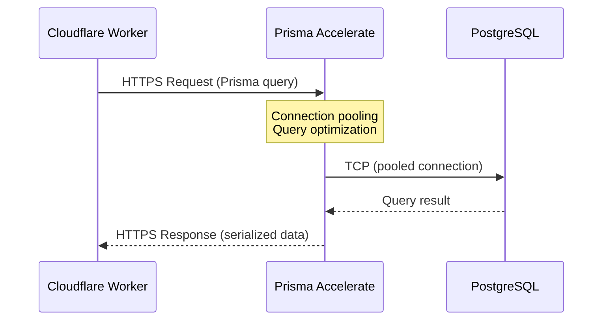
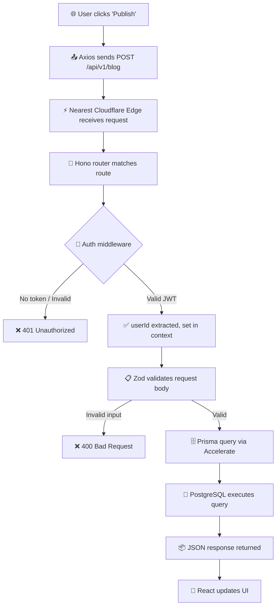
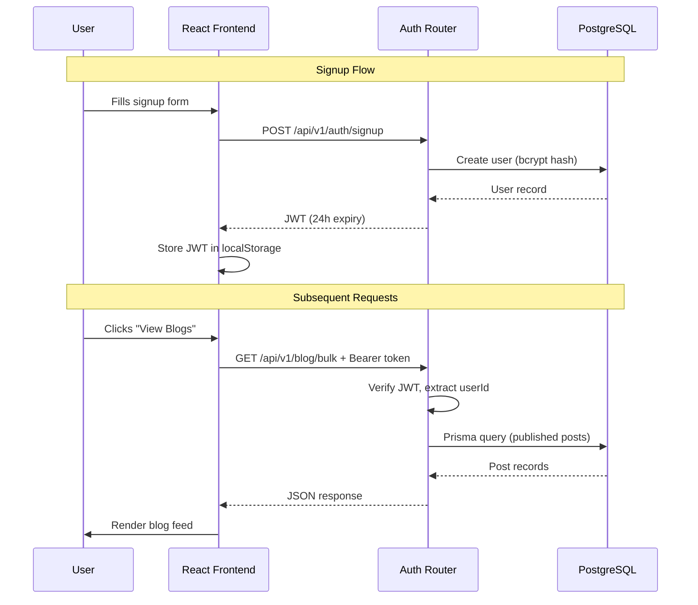
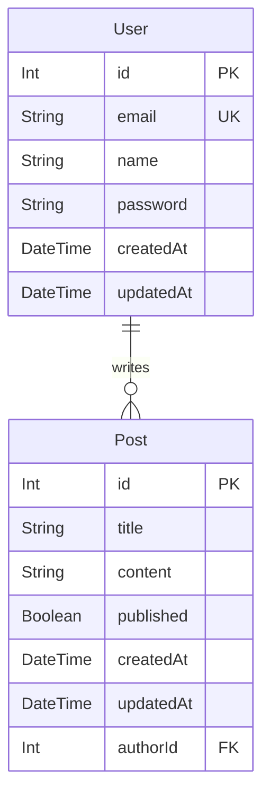

# 🏛️ CloudQuill — System Architecture

This document provides a deep dive into CloudQuill's architecture, the rationale behind its design decisions, and how requests flow through the system.

---

## Overview

CloudQuill follows a **three-tier serverless architecture**:

```
┌──────────────┐     HTTPS     ┌───────────────────┐     Prisma     ┌──────────────┐
│  React SPA   │ ──────────▶   │ Cloudflare Worker  │ ──────────▶   │  PostgreSQL  │
│  (Vite)      │ ◀──────────   │ (Hono.js API)      │ ◀──────────   │  Database    │
└──────────────┘     JSON      └───────────────────┘   Accelerate   └──────────────┘
```

Each layer is independently deployable and scalable.

---

## Why Serverless?

### Traditional Architecture Problems
- **Always-on servers** — You pay for idle compute, even at 3 AM when nobody is reading blogs.
- **Cold start latency** — Traditional serverless platforms (AWS Lambda) have 1–5 second cold starts for Node.js.
- **Connection exhaustion** — Serverless functions spin up many instances, each opening a new database connection. PostgreSQL has a hard limit (~100 connections).

### CloudQuill's Serverless Solution

| Problem | Solution |
|---------|----------|
| Idle compute cost | **Cloudflare Workers** — pay only for requests, no minimum charges |
| Cold starts | Workers use **V8 isolates** (not containers), achieving sub-millisecond cold starts |
| Connection exhaustion | **Prisma Accelerate** provides connection pooling — hundreds of Workers share a small pool |
| Global latency | Workers run in **300+ edge locations** — code executes near the user |

---

## How Cloudflare Workers Interact with the Database

Cloudflare Workers cannot make direct TCP connections to PostgreSQL. The data path is:



### Why Prisma Accelerate?

1. **HTTP-based protocol** — Workers can't open raw TCP sockets, but they can make HTTPS requests. Prisma Accelerate wraps database queries in HTTP.
2. **Connection pooling** — Instead of each Worker opening a connection, Accelerate maintains a small pool of persistent connections.
3. **Global edge caching** — Frequently read data can be cached at the edge (configurable per-query).

---

## Request Lifecycle

Here's the complete journey of a request through CloudQuill:



### Step-by-step Breakdown

| Step | Component | Action |
|------|-----------|--------|
| 1 | **React SPA** | User action triggers an Axios HTTP request |
| 2 | **Axios** | Attaches JWT from `localStorage` as `Authorization: Bearer <token>` |
| 3 | **Cloudflare Edge** | Request routed to the nearest of 300+ global data centers |
| 4 | **Hono Router** | URL pattern matched to a handler (e.g., `POST /api/v1/blog`) |
| 5 | **Auth Middleware** | JWT decoded and verified using `hono/jwt`. User ID injected into `c.set("userId")` |
| 6 | **Zod Validation** | Request body validated against shared schemas from `@quantum-coderr/medium-common` |
| 7 | **Prisma Client** | `getPrisma()` creates an Accelerate-extended client. Query is serialized to HTTP |
| 8 | **Prisma Accelerate** | Receives HTTP query, routes through connection pool to PostgreSQL |
| 9 | **PostgreSQL** | Executes SQL, returns result |
| 10 | **Response** | Data serialized as JSON and returned through the chain |

---

## Authentication Flow



### Security Measures
- **Passwords** are hashed with bcrypt (10 salt rounds) — never stored in plain text
- **JWT tokens** expire after 24 hours
- **Author-only mutations** — delete and publish endpoints verify `post.authorId === userId`
- **Input validation** — all request bodies are validated with Zod before touching the database

---

## Shared Validation Layer

CloudQuill uses a **shared npm package** (`@quantum-coderr/medium-common`) to ensure that the frontend and backend validate data identically:

```
common/src/index.ts
├── signupInput    → { email, password, name? }
├── signinInput    → { email, password }
├── createPostInput → { title, content }
└── updatePostInput → { title?, content? }
```

This means:
- The **frontend** can validate form inputs before sending a request
- The **backend** validates the same schema on arrival
- **Types are inferred** from Zod schemas — no manual interface duplication

---

## Data Model


